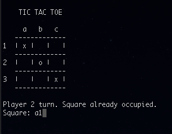

# Tic Tac Toe

Simple console Tic Tac Toe game



## Build

In order to build the project, run the following command:
```sh
gcc **/*.c
```

Once the project is build, the game can be executed with:
```sh
./a.out
```

